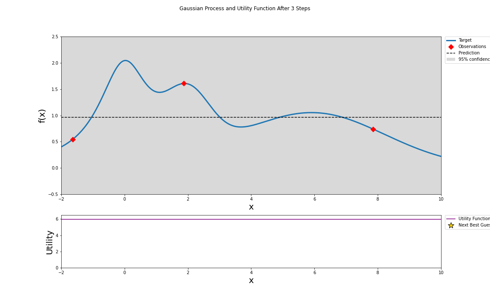

# Testing Bayesian optimization for hyper-parameters tuning

We test the Bayesian optimization methods based on the Gaussian Processes.

Example: Maximizing a 1-dimensional target function (see `notebooks/vis1.ipynb`)

- In this example we start with two initial random guesses.
- Then the Gaussian Process is fit, note that intitially this gives us an uneventful posterior. 
- We use the Upper Confidence Bound as our utility function.
- Kappa - parameter controlling the trade-off between exploration and exploitation; smaller kappa prefers exploitation while larger kappa prefers exploration. We set kappa equals to 5. 

## References

- Taking the Human Out of the Loop: A Review of Bayesian Optimization [PDF](https://dash.harvard.edu/bitstream/handle/1/27769882/BayesOptLoop.pdf;jsessionid=7485393E32A77EF8B44DD97794A8BF0B?sequence=1)

- Practical Bayesian Optimization of Machine Learning Algorithms, J.Snoek et al. (2012) [PDF](https://proceedings.neurips.cc/paper/2012/file/05311655a15b75fab86956663e1819cd-Paper.pdf)

- A Tutorial on Bayesian Optimization of Expensive Cost Functions, with Application to Active User Modeling and Hierarchical Reinforcement Learning, E.Brochu, et al. (2010) [PDF](https://arxiv.org/pdf/1012.2599v1.pdf)

- Gaussian Processes for Machine Learning, C.E.Rasmussen (2006) [Book](http://www.gaussianprocess.org/gpml/chapters/)

- [scikit-optimize](https://github.com/scikit-optimize/scikit-optimize)

- [hyperopt](https://github.com/hyperopt/hyperopt)

